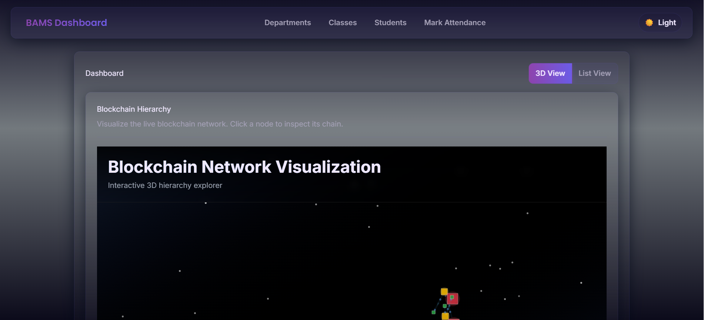
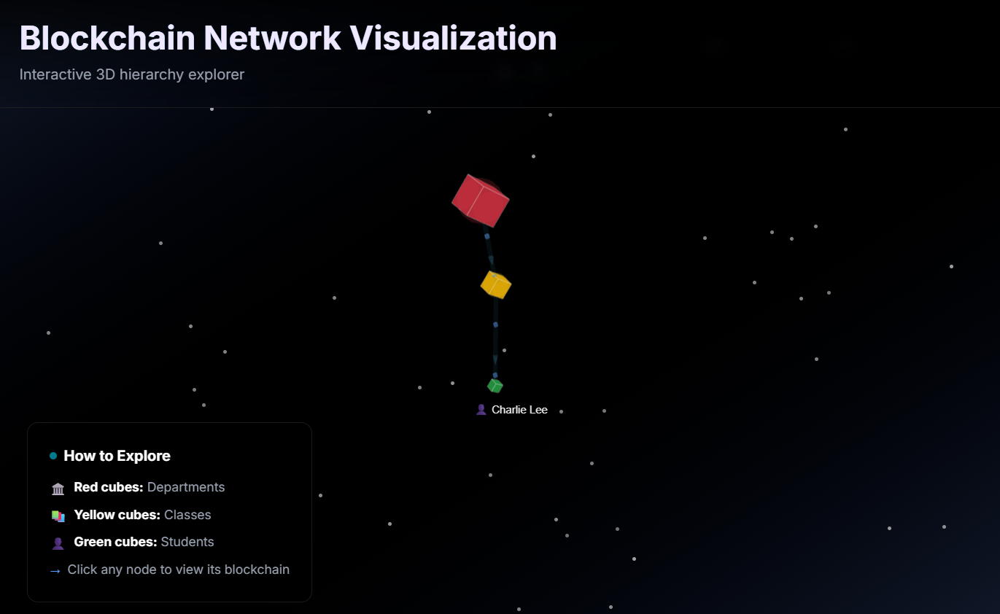
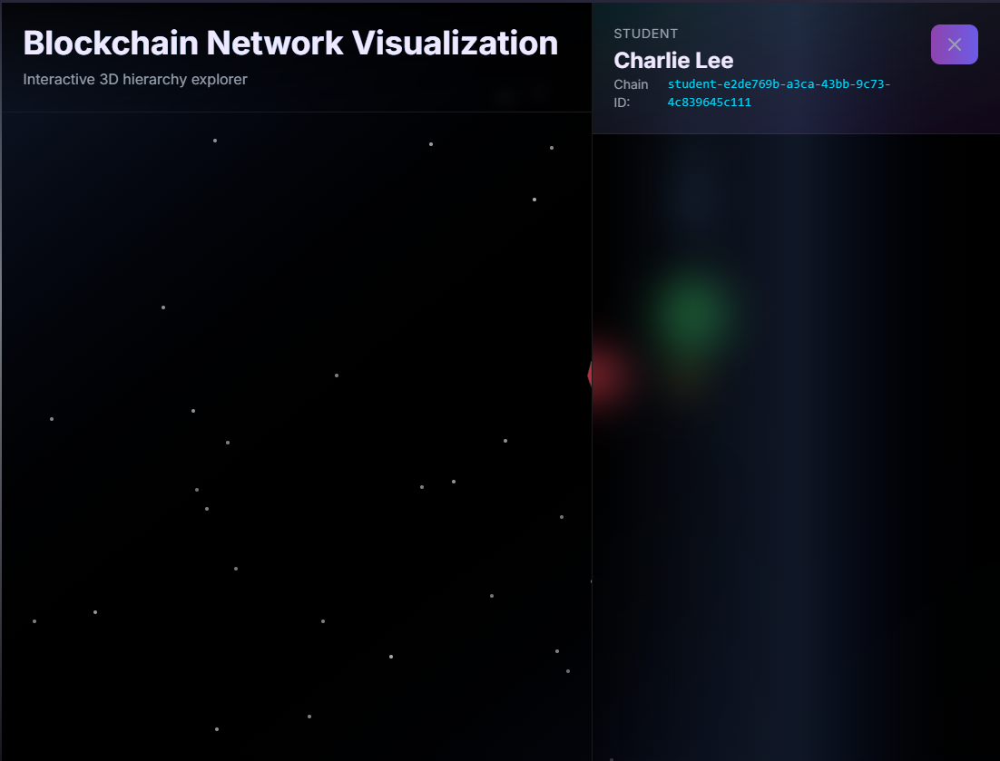
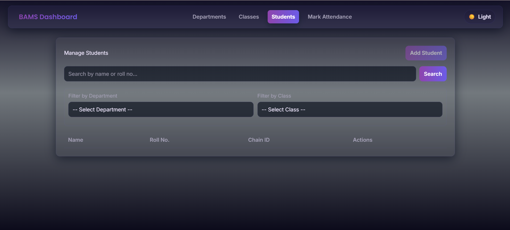
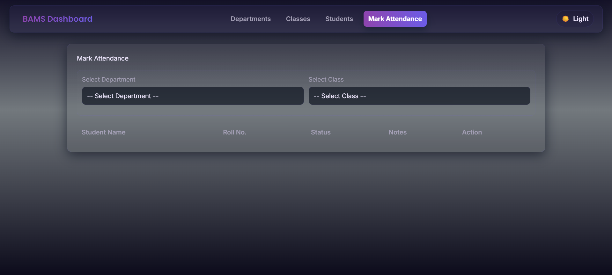

Blockchain-Based Attendance Management System (BAMS)



BAMS is a full-stack web application that re-imagines a standard attendance system using custom-built, multi-layer blockchain technology. It provides a tamper-proof, auditable, and immutable ledger for all records, from department creation down to a single student's attendance mark.

The system features a 3D "Blockchain Universe" visualization, allowing administrators to fly through the complex hierarchy of chains, alongside a robust validation engine that ensures 100% data integrity.

🚀 Key Features

Multi-Layer Hierarchical Blockchain: A custom-built 3-layer chain (Department $\rightarrow$ Class $\rightarrow$ Student), where each child's genesis block is cryptographically linked to its parent chain.

Custom Proof of Work (PoW): Every block, including student attendance marks, is secured by a custom-built PoW consensus (hash must start with 0000).

Immutable CRUD: All "delete" or "update" operations are append-only. A new block is added to the chain, preserving the full historical record.

Interactive 3D "Blockchain Universe": A stunning 3D visualization using react-force-graph-3d that renders the hierarchy as "crystal" nodes in a starfield.

Blockchain Explorer: Click any node in the 3D view to open a sidebar and inspect its complete, individual blockchain ledger, block by block.

Full System Validation: A "Validate All Chains" feature that runs a multi-level check to verify all PoW, all internal chain links, and all parent-child cryptographic links.

Modern Full-Stack: Built with React (Frontend), Node.js/Express (Backend), and MongoDB (Database).

📸 Screenshots

3D Blockchain Universe

Student Ledger





Management & CRUD

Attendance Marking





🏛️ Project Architecture

The core of BAMS is its 3-layer chain architecture. This isn't one flat blockchain; it's a hierarchy of interlinked ledgers.

Department Chain: The top-level chain. It has no parent.

Class Chain: When a Class is created, its genesis block's prev_hash is set to the latest block hash of its parent Department.

Student Chain: When a Student is created, their genesis block's prev_hash is set to the latest block hash of their parent Class.

Attendance Blocks: When attendance is marked, a new block is mined and appended to that specific Student's chain.

This structure means that any change to a parent chain (e.g., editing a Department) is detected by the validation engine, as the cryptographic link to all its children would be broken.

🛠️ Tech Stack

Frontend: React, React Router, Axios, react-force-graph-3d, three-spritetext

Backend: Node.js, Express.js

Database: MongoDB Atlas, Mongoose

Blockchain: Custom-built logic using Node.js crypto (SHA-256)

Deployment: Vercel (Frontend), Render (Backend)

⚙️ Getting Started (Local Development)

Prerequisites

Node.js (v18.x or later)

Git

MongoDB Atlas Account: You will need a (free) MongoDB Atlas cluster.

Create the cluster.

In Network Access, add 0.0.0.0/0 (Allow Access From Anywhere).

In Database Access, create a database user (e.g., bamsUser / password123).

Click Connect $\rightarrow$ Connect your application and copy the connection string.

1. Backend Setup

Clone the repository:

git clone https://github.com/ibrahim3702/Blockchain-Attendance-Management-System/
cd Blockchain-Attendance-Management-System/backend


Install dependencies:

npm install


Create your environment file. Create a file named .env in the backend folder:

MONGODB_URI=<YOUR_MONGODB_ATLAS_CONNECTION_STRING>
PORT=5000


Make sure to replace <password> in your connection string with the user password you created.

Start the backend server:

npm start


The backend will be running on http://localhost:5000.

2. Frontend Setup

Open a new terminal.

Navigate to the frontend folder:

cd Blockchain-Attendance-Management-System/frontend


Install dependencies:

npm install


Start the frontend development server:

npm run dev


The React app will open on http://localhost:3713 and will automatically connect to your backend at http://localhost:5000 (this is pre-configured in api.js).

3. (Optional) Seed the Database

To fill the app with dummy data (departments, classes, students, and attendance blocks):

Make sure your backend server is NOT running.

In your backend terminal, run:

node seed.js


Once it's finished, you can start your backend again (npm run dev) and view the data.

🚀 Deployment

The recommended way to deploy this project is to use two separate services: Render for the backend and Vercel for the frontend.

1. Backend Deployment (Render)

Push your project to a GitHub repository.

Sign up for Render and create a new Web Service.

Connect your GitHub repository.

Set the Root Directory to backend.

Set the Build Command to npm install.

Set the Start Command to node server.js.

Go to the Environment tab and add your MONGODB_URI as a secret.

Deploy. Render will give you a public URL (e.g., https://bams-backend.onrender.com).

2. Frontend Deployment (Vercel)

Sign up for Vercel and connect your GitHub repository.

Import the project.

Set the Framework Preset to Create React App.

Set the Root Directory to frontend.

Crucially: You must tell your React app where the deployed backend is.

Open frontend/src/services/api.js.

Change the API_URL from http://localhost:5000/api to your Render URL:

const API_URL = '[https://bams-backend.onrender.com/api](https://bams-backend.onrender.com/api)'; 


Commit and push this change.

Deploy. Your frontend will be live on Vercel and fully connected to your backend on Render.

---

## 🐳 Docker Containerization

### Tools & Technologies

| Layer | Technology |
|---|---|
| Frontend | React 19, Vite, Tailwind CSS, Nginx (Alpine) |
| Backend | Node.js 18, Express.js |
| Database | MongoDB 7 |
| Containerization | Docker, Docker Compose |
| Orchestration | Kubernetes (Minikube) |

### Application Architecture (Containerized)

```
┌─────────────────────────────────────────────┐
│              Host / Browser                  │
└───────────────────┬─────────────────────────┘
                    │ :3000
        ┌───────────▼───────────┐
        │   Frontend (Nginx)    │  port 80
        │   React SPA           │
        │   /api/* → backend    │
        └───────────┬───────────┘
                    │ :4000 (internal)
        ┌───────────▼───────────┐
        │   Backend (Node.js)   │  port 4000
        │   Express REST API    │
        └───────────┬───────────┘
                    │ :27017 (internal)
        ┌───────────▼───────────┐
        │   MongoDB             │  port 27017
        │   Persistent Volume   │
        └───────────────────────┘
```

All three containers share a Docker bridge network (`bams-network`), allowing them to reach each other by service name.

---

## 🐳 Docker Build & Run Instructions

### Prerequisites
- Docker installed and running

### Build Images

```bash
# Build backend image
docker build -t bams-backend ./backend

# Build frontend image
docker build -t bams-frontend ./frontend
```

### Run Containers Individually

```bash
# Start MongoDB
docker run -d --name mongo -p 27017:27017 mongo:7

# Start Backend
docker run -d --name backend -p 4000:4000 \
  -e MONGODB_URI=mongodb://host.docker.internal:27017/bams \
  bams-backend

# Start Frontend
docker run -d --name frontend -p 3000:80 bams-frontend
```

### Verify

```bash
# Check running containers
docker ps

# Test backend
curl http://localhost:4000

# Open frontend in browser
open http://localhost:3000
```

---

## 🐙 Docker Compose Setup

Docker Compose runs all three services together on a shared network with a single command.

### Start All Services

```bash
# Build images and start all containers
docker-compose up --build

# Run in background
docker-compose up --build -d
```

### Stop All Services

```bash
docker-compose down
```

### Services

| Service | Image | Host Port | Container Port |
|---|---|---|---|
| frontend | built from ./frontend | 3000 | 80 |
| backend | built from ./backend | 4000 | 4000 |
| mongo | mongo:7 | 27017 | 27017 |

### Environment Variables

| Variable | Service | Value |
|---|---|---|
| `MONGODB_URI` | backend | `mongodb://mongo:27017/bams` |
| `PORT` | backend | `4000` |
| `VITE_API_URL` | frontend (build arg) | `/api` |

---

## ☸️ Kubernetes Deployment

### Prerequisites

```bash
# Install kubectl
sudo snap install kubectl --classic

# Install and start minikube
curl -LO https://storage.googleapis.com/minikube/releases/latest/minikube-linux-amd64
sudo install minikube-linux-amd64 /usr/local/bin/minikube
minikube start --driver=docker
```

### Load Local Images into Minikube

```bash
minikube image load blockchain-attendance-management-system_backend:latest
minikube image load blockchain-attendance-management-system_frontend:latest
```

### Deploy All Resources

```bash
# Apply in order
kubectl apply -f k8s/mongo-pv-pvc.yaml
kubectl apply -f k8s/mongo-deployment.yaml
kubectl apply -f k8s/backend-deployment.yaml
kubectl apply -f k8s/frontend-deployment.yaml
kubectl apply -f k8s/hpa.yaml
```

### Kubernetes Files

| File | Description |
|---|---|
| `k8s/backend-deployment.yaml` | Backend Deployment (3 replicas) + ClusterIP Service |
| `k8s/frontend-deployment.yaml` | Frontend Deployment (3 replicas) + NodePort Service |
| `k8s/mongo-deployment.yaml` | MongoDB Deployment + ClusterIP Service |
| `k8s/mongo-pv-pvc.yaml` | PersistentVolume + PersistentVolumeClaim (2Gi) |
| `k8s/hpa.yaml` | HorizontalPodAutoscaler for frontend & backend |

### Verify Deployment

```bash
kubectl get deployments
kubectl get pods
kubectl get services
kubectl get pv,pvc
kubectl get hpa
```

### Access the Application

```bash
minikube service frontend --url
```

---

## 💾 Persistent Storage

MongoDB data is stored using a Kubernetes PersistentVolume so data survives pod restarts.

| Resource | Name | Capacity | Access Mode |
|---|---|---|---|
| PersistentVolume | `mongo-pv` | 2Gi | ReadWriteOnce |
| PersistentVolumeClaim | `mongo-pvc` | 2Gi | ReadWriteOnce |

The volume is mounted at `/data/db` inside the MongoDB container.

---

## 📈 Scaling Configuration

Horizontal Pod Autoscaling (HPA) is configured for both frontend and backend.

| Setting | Value |
|---|---|
| Minimum Pods | 2 |
| Maximum Pods | 5 |
| CPU Utilization Target | 70% |

Enable the metrics server in minikube for HPA to work:

```bash
minikube addons enable metrics-server
```

Verify autoscaling:

```bash
kubectl get hpa
```

To manually test scaling:

```bash
# Scale backend to 5 replicas manually
kubectl scale deployment backend --replicas=5

# Watch pods scale
kubectl get pods -w
```
